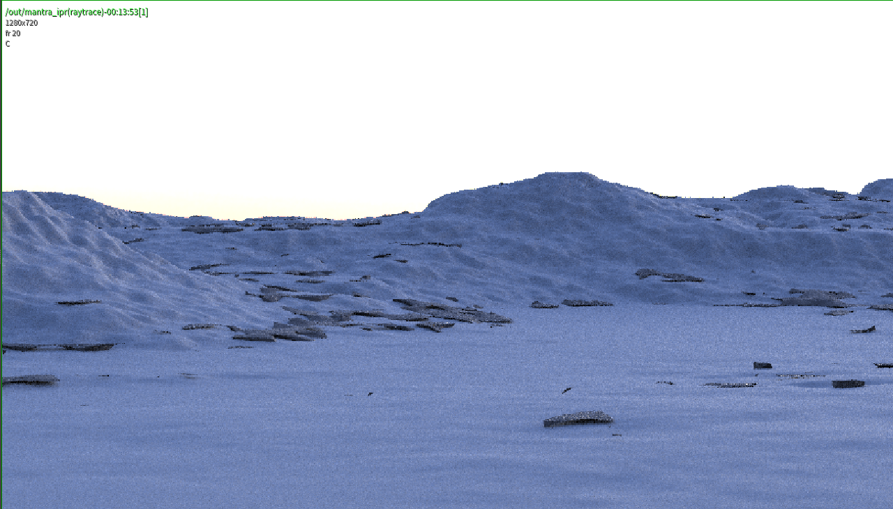

# hw05 Houdini Terrain

### Took one late day.

### For the Terrain part

* Followed loosely this tutorial https://www.youtube.com/watch?v=rwLbiuKX5D0
* Created curves and merged different layeres of noise using multiple nodes to get a terrain.

### For the scene object

* Scattered boxes that were procedural modified with multiple nodes that jitter their points and change randomly the look of the box.
* Smooth and reduced polygons.
* This achieved a procerual rock look.

### For the make it usable:

* Exported my network as a hda with 3 paramters: terrain color ramp, rock color ramp and ampltide of additional noise layered on top of base terrain.

### For extra spice

* Created procedural coloring using different masks and filters inside a COP2 Network

Let's explore Houdini and get a basic understanding of the workflow and interface.

For this assignment, our resident Houdini expert Dan will provide a a simple Houdini network that spawns objects on a bit of terrain. It's not a terribly complex or interesting scene! Please experiment to make it more interesting :)

### Terrain (15 pts)
Using at least 6 additional nodes, make the terrain more realistic, or otherwise interesting. Suggestions: layered noise, merging in another shape, sin wave hills.

### Scene Objects (20 pts)
Using the provided set up, change the unit cubes to a more interesting model. Add your chosen models on top of the terrain using more complex scattering logic. Suggestions: import a model and scatter them in an attractively random manner, grow l-system that are more dense in one area than another, model something in Houdini and place them in a summoning circle.

### Make it usable! (15 pts)
Once you're satisfied Make your toy a usable tool by adding at three widgets/parameters that are referenced in your graph. Export your project as an HDA with three exposed parameters to mimic professional packaging.

### Extra spice (20 pts)
Add something extra to your scene! Experiment! If it's wonky, who cares! Google and Youtube are full of interesting resources. Look through the docs pages for ideas too. Suggestions: Add coloring based on some rule. Animate some elements of your scene. 

### Submission
Submit your Houdini file to canvas this time, since this assignment isn't githubable.
